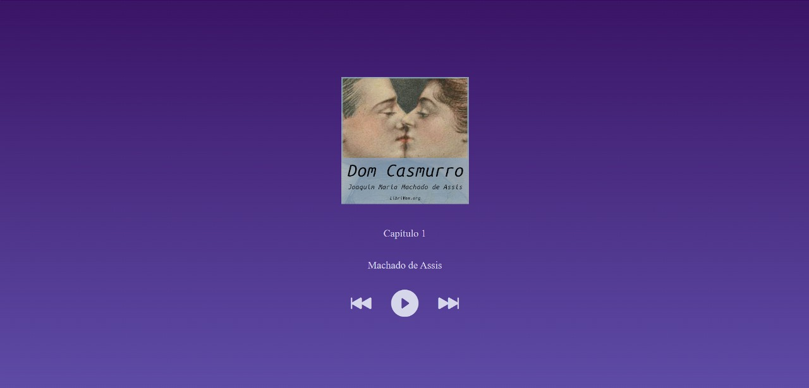

# AudioBook em Javascript + HTML e CSS

Neste projeto é possivel ouvir os 10 capítulos da obra de Machado de Assis, Dom Casmurro.

## Printscreen do projeto

# Como usar?

## Passo 1: Clone o projeto

Clone o repositório do projeto para uma pasta sua e abra-o em uma IDE (VisualStudio Code,..) de sua preferência

## Passo 2: Execute a página HTML

1. Instale a extensão Live Server para visualizar a página HTML
2. Clique com o botão direito no arquivo 'index.html' e depois clique na opção 'Open with Live Server'
3. Uma página abrirá no seu navegador e lá você poderá testar/ouvir a obra de Machado de Assis
